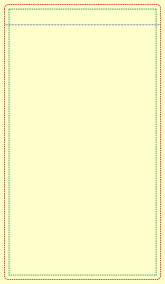
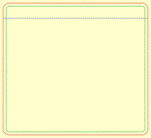

# 🎮 Cartridge Label Templates for NES & Sega Genesis

A comprehensive collection of high-quality cartridge label templates designed for retro gaming enthusiasts. These templates allow you to create, modify, and print custom labels for **NES** and **Sega Genesis / Mega Drive** cartridges. 

---

## 📌 Project Overview

This repository provides highly accurate templates modeled after official dimensions and specifications. Originally inspired by community guides from [Stoneage Gamer](https://stoneagegamer.com), these assets have been rebuilt and formatted across multiple extensions to fit your preferred graphic design software.

### 📐 Supported Formats & Software
* 🎨 **Vector Editing:** `.svg` formats tailored perfectly for [Inkscape](https://inkscape.org/).
* 🖌️ **Layered Raster Editing:** `.pdn` files native to [paint.net](https://www.getpaint.net/) and `.psd` files for [Adobe Photoshop](https://www.adobe.com/products/photoshop).
* 🖼️ **Universal Previews:** Ready-to-use `.png` images.

---

## 🗺️ Visual Templates

| 🟢 NES Label Template | 🔵 Sega Genesis / Mega Drive Template |
| :---: | :---: |
|  |  |

---

## 🛠️ Getting Started & Printing Tips

To get the best results when printing your custom cartridge labels, follow these recommended steps:

1. **Choose Your Format:** 
   * Use `.svg` if you need infinitely scalable vector artwork.
   * Use `.pdn` or `.psd` if you prefer working with pixel-based layers and blending effects.
2. **Design Your Artwork:** Keep your vital text and logos slightly away from the extreme edges to prevent clipping during cutting (**Safe Zone**).
3. **Print Settings:** Always print at **100% scale** (Do not use "Fit to Page").
4. **Paper Recommendation:** For an authentic look, use **glossy sticker paper** or vinyl adhesive sheets, and consider adding a clear laminate overlay to protect against scratches and fading.

---

## 🤝 Credits & References

Special thanks to the retro gaming community and resources that made these templates precise:
* [Stoneage Gamer - NES Label Dimensions](https://stoneagegamer.com/everdrive-n8-label.html)
* [Stoneage Gamer - Sega Megadrive Label Dimensions](https://stoneagegamer.com/mega-everdrive-label.html)
